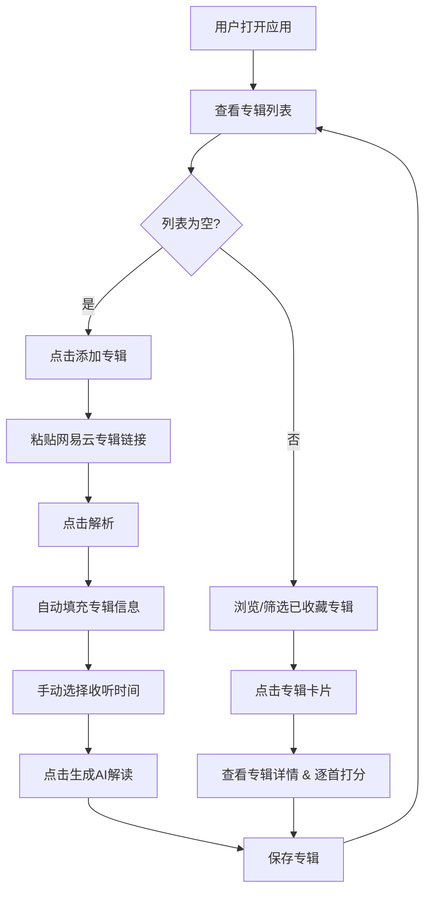

## 1. 产品概述

「专辑记录簿」是一款用于记录和收藏个人收听专辑的 Web 应用。用户可以通过粘贴网易云音乐专辑分享链接，自动解析并填充专辑名、歌曲列表、风格分类等信息，同时借助 AI 生成专辑的深度解读，并为每首歌曲打分，形成个人化的音乐品味档案。

- **目标用户**：热爱音乐、喜欢收藏整张专辑并记录听感的乐迷
- **核心价值**：让专辑收藏不再只是"添加到歌单"，而是形成带有个人评分和 AI 解读的音乐日记

## 2. 核心功能

### 2.1 用户角色

| 角色 | 说明 |
|------|------|
| 普通用户 | 无需注册登录，所有数据保存在本地浏览器 |

### 2.2 功能模块

1. **专辑列表页**：展示所有已收藏的专辑卡片，支持按风格分类筛选和时间排序
2. **添加专辑页**：粘贴网易云专辑链接自动解析，手动补充信息，AI 生成解读
3. **专辑详情页**：查看完整歌曲列表、逐首打分、阅读 AI 解读

### 2.3 页面详情

| 页面名称 | 模块名称 | 功能描述 |
|----------|----------|----------|
| 专辑列表页 | 顶部导航 | 应用标题、添加专辑按钮 |
| 专辑列表页 | 分类筛选栏 | 按风格标签（摇滚/电子/流行/爵士/嘻哈等）筛选专辑 |
| 专辑列表页 | 专辑卡片网格 | 展示专辑封面、名称、收听时间、评分概览，点击进入详情 |
| 专辑列表页 | 空状态引导 | 无专辑时展示引导文案和快速添加入口 |
| 添加专辑页 | 链接输入区 | 粘贴网易云分享链接，点击解析自动填充信息 |
| 添加专辑页 | 信息编辑表单 | 手动编辑专辑名、收听时间、风格分类、歌曲列表 |
| 添加专辑页 | 专辑解读生成 | 点击按钮由 AI 生成专辑解读，支持重新生成 |
| 专辑详情页 | 专辑信息头部 | 封面大图、专辑名、风格标签、收听时间 |
| 专辑详情页 | 专辑解读 | 展示 AI 生成的专辑解读文字 |
| 专辑详情页 | 歌曲评分列表 | 逐首歌曲展示，星级评分，可编辑 |
| 专辑详情页 | 删除操作 | 删除当前专辑记录 |

## 3. 核心流程

用户粘贴网易云专辑链接 → 系统调用后端解析链接获取专辑信息 → 自动填充专辑名、封面、歌曲列表、风格标签 → 用户手动选择收听时间 → AI 根据专辑信息生成专辑解读 → 用户在详情页逐首打分 → 专辑卡片展示在首页列表

## 4. 用户界面设计

### 4.1 设计风格

参考 Apple Music 的设计语言，打造明亮通透、层次分明的视觉体验：

- **整体风格**：明亮现代的 Apple Music 风格 —— 白色干净背景、超大封面图、大字号粗体标题、大面积留白、圆润柔和的卡片层次，如同 Apple Music "浏览"和"资料库"标签页的轻快愉悦感
- **主色调**：纯白底板 `#ffffff` / 浅灰底 `#f2f2f6`（Apple Music 标志性浅灰背景），苹果红 `#fa2d48` 作为强调色
- **辅助色**：深黑 `#000000` 用于大标题文字，中灰 `#8e8e93` 用于辅助文字，淡粉 `#fce4e8` 用于专辑解读区的柔和底色
- **字体**：
  - 大标题字体：系统原生粗体 -apple-system / SF Pro Display Bold（中文搭配 PingFang SC Semibold），字号大、重量感强
  - 正文字体：清晰易读的 -apple-system / SF Pro Text Regular
- **专辑卡片风格**：白色圆角卡片 `rounded-2xl`，封面图撑满卡片顶部，下方文字区域留白充足，带有极淡阴影 `shadow-sm`，悬停时轻微上浮 `hover:shadow-md` + 放大 `hover:scale-[1.02]`
- **按钮**：苹果红实心主按钮 `rounded-full` 胶囊形（类似 Apple Music 的"播放"按钮），浅灰描边次按钮
- **导航**：顶部大面积白色区域 + 大号页面标题（类似 Apple Music 各标签页顶部），底部无 TabBar
- **布局**：桌面端网格布局，移动端单列堆叠

### 4.2 页面设计概览

| 页面名称 | 模块名称 | UI 元素 |
|----------|----------|---------|
| 专辑列表页 | 顶部导航 | 左侧大号粗体标题，右侧苹果红圆形"+"添加按钮 |
| 专辑列表页 | 分类筛选栏 | 水平滚动圆角胶囊标签，选中态苹果红填充白字，默认态浅灰底深灰字 |
| 专辑列表页 | 专辑卡片网格 | 3-4 列网格，每张白底卡片含封面图、专辑名、收听日期、星级评分条 |
| 专辑列表页 | 空状态 | 大型唱片图标，居中引导文案，苹果红"添加第一张专辑"胶囊按钮 |
| 添加专辑页 | 链接输入区 | 白色圆角输入框配浅灰边框，右侧苹果红"解析"胶囊按钮；解析中显示旋转动画 |
| 添加专辑页 | 信息编辑表单 | 白色表单区域，专辑名输入框，风格多选标签，日期选择器 |
| 添加专辑页 | 专辑解读 | 生成按钮 + 文本展示区，生成中显示打字动画 |
| 专辑详情页 | 专辑信息头部 | 左侧大尺寸封面图，右侧信息区，苹果红风格标签 |
| 专辑详情页 | 专辑解读 | 左侧竖线装饰的引用块样式，浅粉背景 |
| 专辑详情页 | 歌曲评分列表 | 每行：序号 + 歌名 + 星级评分组件 |

### 4.3 响应式设计

- 桌面优先设计（宽度 ≥ 1024px 时展示 3 列网格）
- 平板（768px - 1023px）展示 2 列网格
- 手机（< 768px）单列布局，卡片全宽，导航简化
- 所有触控目标 ≥ 44px
