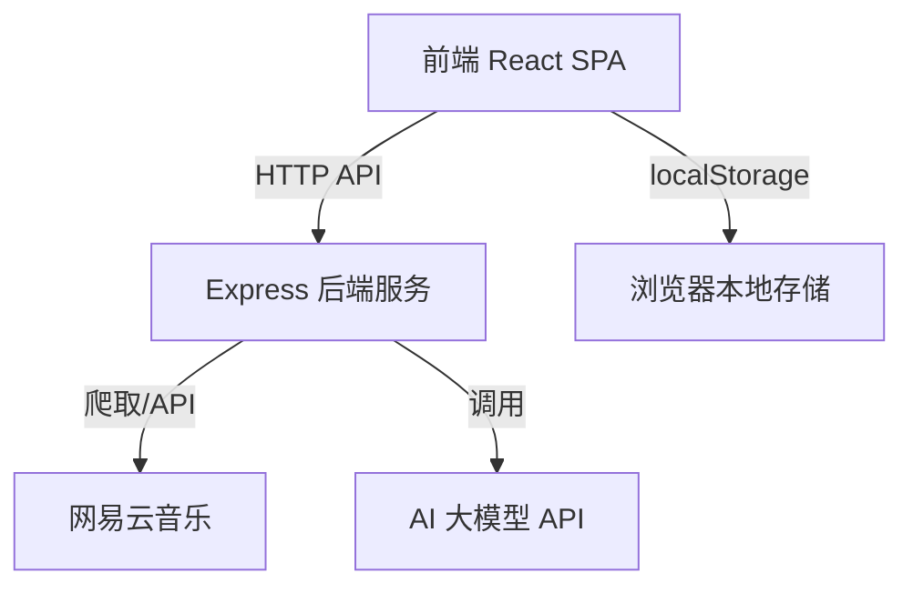
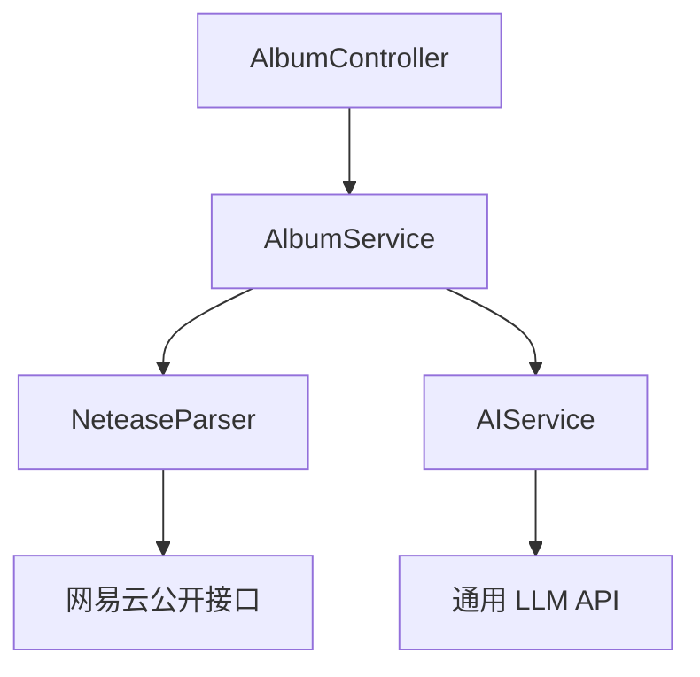
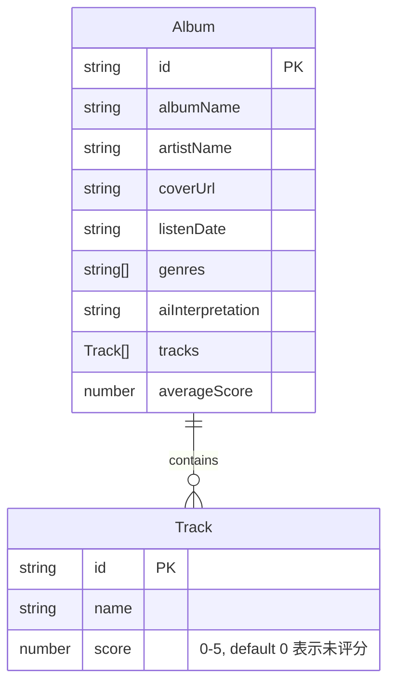

## 1. 架构设计



## 2. 技术描述

- **前端**：React@18 + TypeScript + Tailwind CSS@3 + Vite
- **初始化工具**：vite-init (react-express-ts 模板)
- **后端**：Express@4 + TypeScript
- **状态管理**：Zustand
- **图标**：lucide-react
- **数据存储**：浏览器 localStorage（无需数据库）
- **外部服务**：
  - 网易云音乐解析（通过后端抓取公开接口）
  - 专辑解读（接入通用大模型 API，如 OpenAI 兼容接口）

## 3. 路由定义

| 路由 | 页面 | 说明 |
|------|------|------|
| `/` | 专辑列表页 | 首页，展示所有已收藏专辑 |
| `/add` | 添加专辑页 | 粘贴链接、编辑信息、生成专辑解读 |
| `/album/:id` | 专辑详情页 | 查看专辑详情、歌曲评分 |

## 4. API 定义

### 4.1 解析网易云专辑链接

```
POST /api/album/parse
```

**请求体：**
```typescript
{
  url: string  // 网易云专辑分享链接
}
```

**响应体：**
```typescript
{
  success: boolean
  data?: {
    albumName: string
    coverUrl: string
    artistName: string
    tracks: { name: string; id: number }[]
    genres: string[]
  }
  error?: string
}
```

### 4.2 AI 生成专辑解读

```
POST /api/album/interpret
```

**请求体：**
```typescript
{
  albumName: string
  artistName: string
  tracks: string[]
  genres: string[]
}
```

**响应体（SSE 流式）：**
```typescript
{
  content: string  // 流式返回的解读内容
}
```

## 5. 服务端架构



## 6. 数据模型

### 6.1 数据模型定义



### 6.2 TypeScript 类型定义

```typescript
interface Track {
  id: string
  name: string
  score: number  // 0-5, 0 表示未评分
}

interface Album {
  id: string
  albumName: string
  artistName: string
  coverUrl: string
  listenDate: string  // ISO date string
  genres: string[]
  aiInterpretation: string
  tracks: Track[]
  averageScore: number
}
```

数据通过 Zustand 管理并持久化到 localStorage，前端本地完成增删改查操作。
